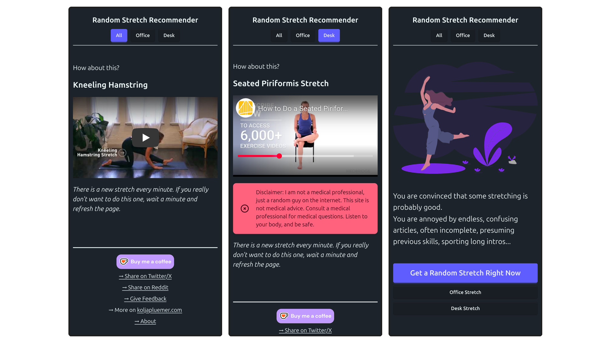

# Random Stretch

A simple vue app recommending a random stretching exercise. Available online [here](https://stretch.koljapluemer.com/)

> [!NOTE]  
> I froze the development of this project for now to focus on other things. The website itself will stay online.

## Development

- Vue3/Vite/Tailwind/Daisy/typescript
- Run it with:
    1. `npm i`
    2. `npm run dev`
- classic folder-by-type architecture: find core features in `src/components/`, `src/views/` and so on
